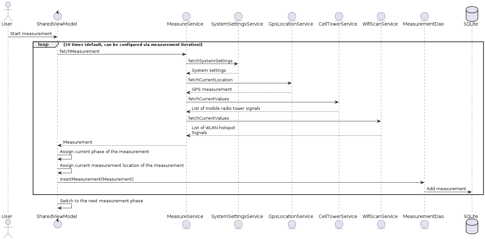

    

Measuralyze is a portmanteau of measure + analyze.

The Android App to analyze a GNSS position measurement, extracting information such as Cell Tower Id and a list of available WiFi routers that could influence the measurement.

Created as part of a bachelors thesis at Lucerne University of Applied Sciences, spring semester 2024.

____

## Features
The application is used to carry out GPS measurements at multiple locations with different system settings. 
It records the available information on Wi-Fi routers and mobile phone towers in the vicinity. 
To ensure that the settings previously defined by the person taking the measurement were actually active on the phone at the time of the measurement, the system setting values are also extracted.

## Solution Strategy

## Building Block View

### Level 1

### Level 2

### Level 3 - MeasureService

## Runtime View
### App Startup

### Measuring Process

### Update Configuration

### Delete Recorded Measurements

## Risks and technical debt
### Limitations
Google seems to increasingly want to restrict access to certain system settings: There is no way to programmatically check whether the “Google Location Accuracy” setting is enabled or disabled. Existing ways to read the “Wi-Fi Scanning” setting have been marked as deprecated without replacement[^1]. In the absence of an alternative, the obsolete functions are still used, but may not work as desired with a new Android version.

### Technical Debt
This app was developed with very little experience in Android development, as well as time constraints. 
This has led to higher code complexity and less than optimal code quality and readability.
If this app is to be further developed, it is recommended to refactor the codebase surrounding the user interface to improve maintainability and readability.

[^1]: here's my stackoverflow question further explaining this issue: https://stackoverflow.com/questions/78193272/fetching-wifi-scanning-location-system-setting-on-android-without-deprecated-fun

